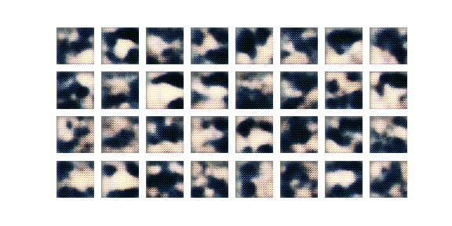

# FishGAN
This is the first attempt using a simple DCGAN for the tropical fish generator 

## General notes:
* Attempts were moderately successful, but many attempts to improve went nowhere (which I probably should have suspected with a 128x128 grid)
* Many of the comments below concern generator on kaggle and colab for GPU) 

## Comments on specific architectures
### Notes for: RMS lr = 0.001 inputs = 100
#### Generator = conv2dT 4x1 
#### Discriminator = conv2d 4x1
* Works pretty well
* Generates beautiful images, but no sharp lines
* Color scheme tends to jump from one epoch to the next (may suggest a lower LR would help)
* No signs of mode collaspe after 200 epochs, but not really converging either
* RMSprop seems to work better than Adam (b1=0.9; b2=0.999)

### Notes for: inputs = 100
#### Generator = conv2dT 4x1, RMSprop lr = 0.00015
#### Discriminator = conv2d 4x1, RMSprop lr = 0.0001
* works even better (took about 350 epohs)
* Generates beautiful images, with better sharp lines
* Color scheme is varied throughout and not jumping from one to another
* LR = 0.002 worked okay, but 0.0001 was better
* FishGANsimple.ipynb produced (note: initialization changed slightly) 
* model saved as fish_gan_1.h5

Format: ![Alt Text]

Format: 

### Notes for: Adam lr = 0.00003 inputs = 128 
#### Generator = conv2dT 4x3
#### Discriminator = conv2d 4x3
* VGG style architecture
* working okay, may be worth some optimization
* not as stable as the simple formats above
* looks like it has a mode collapse
* slow, but produced sharp features

### Notes for:  inputs = 128 
#### Generator = conv2dT 4x1 Adam lr = 0.0003
#### Discriminator = conv2d 4x3 Adam lr = 0.0002
* asymmetric architure with the "standard" generator and a VGG 4x3 style discriminator
* very promising, discriminator knows its fish, generator images look pretty good, still color flopping though
* generator is likely unable to keep up with the quality of the discriminator, perhaps a more modest augmentation is in order with a lower learning rate

## Other attempted modifications:
* Adding dropout to the generator helped a fair bit
* Expanding the last generator level and adding a high dropout seemed to help
* Adding short, long, and very long image memory to keep the discriminator more stable seems to help, but convergence isn't as good
* Asymmetric LR seems effective. A slightly faster generator seems less likely to fall behind. Overall, images not as good though.
* Gen using RMSprop and Disc using Adam shows promise

## Failures:
* attempts to naively expand these network deeper have gone poorly (VGG okay)
* Starting with a 4x4x1024 layer has not gone well (definite mode collaspe even early on)
* selu -> LeakyReLU in the generator has not worked (it will work ultimately, but spends a long time - 20 epochs - as noise)
* Adam never seems to work quite as well as RMSprop (however, may be better with patterns, but could be mode collapse) - may be due to LR being too high
* Expanded 256-128-64-32 to 256-192-128-96 did not perform very poorly, but it also didn't work as well
* Using SGD on the discriminator was spectularly unsuccessful
* My initial implementations of Wasserstein has not performed well with any hyperparameters I have tried
* Wasserstein through TF-GAN does not work currently, the colab notebook doesn't seem compatible with TF2

## Note on using a TPU:
* running the generator(noise) step becomes the bottleneck, for whatever reason I can't seem to force to TPU to evaluate the generator
* (In hindsight, I suspect this was because the strategy.scope was not including the full compilation of the generator which was compiled within the gan itself)

## To Check (these options abandoned in favor of ProGAN):
* for asym with VGG disc, add a more complex gen and lower learning rate considerably
* improvements to VGG style architecture
* asymetric architecture (experiment with others)
* Dual discriminators
