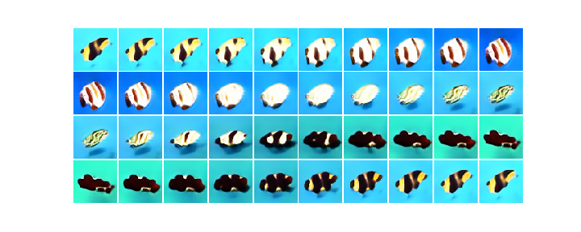
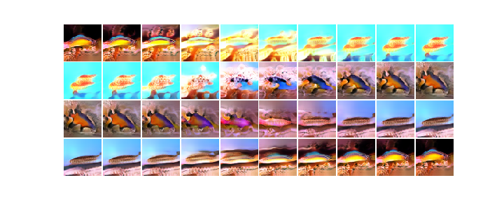

# WGAN-GP

This is heavily influenced by ProgressiveGAN, but I didn't use the progressive aspect. Overall, a big success.  This is an expansion of the 32x32 case.  I grew the next and ran for a bit longer on 64x64 images and then used those to train the GAN.  See WGAN-GP-64.ipynb for specific implementations.

## The implementation
I used a fairly asymmetric architecture to generate this (listed below) with the following aspects included:  
* Wasserstein metric with gradient penalty lambda=10.0 (WGAN-GP)
* Pixel normalization in the generator
* Mini-batch standard deviation in the critic
* Dropout in the critic (0.5)
* The critic shrunk via stride 2, kernel-size 4; while the generator grew via upsampling (used upsampling instead of stride due to checkerboard artifacts)
* Added a drift term to the critics loss (0.001 * {critic outputs^2}
* Used image augmenation - rot=25, wshift=0.05, hshift=0.1, shear=10, zoom=[0.95,1.2], brightness=[0.8,1.4]; also adjusted color saturation using a random.triangle from [0.6,1.4] for R, G, and B individually
* Used a running average generator for output with an exponential loss of 0.999
* Ran critic 4 times for every one generator run
* Used Adam with beta1 = 0, beta2 = 0.99 (mostly equivalent to RMSprop) with a learning rate of:
- lr = 0.0001 for the first 100 epochs; lr = 0.00005 for the next 300 epochs; lr randomly sampled from 0.0000{6-2} per batch for 400 epochs; lr = 0.000025 for 300 epochs; lr = 0.00002 for the last 1400 epochs (see discussion below for why I changed the lr with Adam)
 
## Some things I tried but did not use here:
* Despite having encoded it, I did not use equalized learning rate on the conv layers.  I might be tempted to try this, but the images are fairly diverse, and this is where I would see this helping most.

## Well, how could this be improved?  
* I could try to restart with an extended architecture that goes to 128x128.
* I could try to extend the architecture a la ProGAN, which might work.  I did not build the network to handle this though.  
* I think the critic is too weak overall relative to the generator.  It seems to have trouble with details like fins and eyes.
* I could run it longer, with a low learning rate and I think it will get a bit better - especially at improving the already fishy looking fish, however, I don't think this will do too much to prevent the poor quality images.

## Fishing in a diverse terrain

Some fish are truly wonderful.  Others... not so much.  I took steps to avoid mode-collaspe (Wasserstein and MBStdDev, especially), and the generator has done a great job at producing a diverse array of fish, but this diversity is probably also the source of the crappy fish.  
   
Above you can see at the ends four pretty decent looking fish.  As I walk from one point of a good fish in the latent space to another, the fish smoothly evolve into one another and we have a nice fish all along the way.  On the other hand, if I consider fish with vastly different shapes and structures:  
  
I lose the intermediate fish, simply because in deforming one image into another, I (and the critic) no longer recognize these intermediate images as fish.  Although my generator makes excellent and very different fish at one point in the plane, the image simply has to stop being fishy as I go from one to another.  Short of losing one of the diverse images, I am not sure how much can really be done when any path to deform one image to another must make something that looks decidedly non-fish-like along the way.  Perhaps I am underestimating the creativeness of the network, but I think it is an inescapable problem.  That said, surely more of the journey could look fish-like.  

### Why did you change the learning rate if using Adam?
That is a good question.  For most purposes, a fixed lr is fine for Adam, as it will adjust and adapt to find the (local) minimum.  In GANs though, the problem is more complex.  The manifold the generator is trying to find the minimum of is itself moving, largely based on the movement of the generator within this manifold.  The state is not a minima, but rather a Nash equilibrium.  In this equilibrium, both players trickle into a steady state where no change of strategy will improve their performance (lower the loss).  When both players are making too large of moves, the equilibrium can either become unable to settle further or even become disrupted making a stable state hard to find again.  Correcting finer features in images becomes challenging when the two players keep making big moves.  This is also the motivation for trying the randomized learning rate I mentioned above.   
