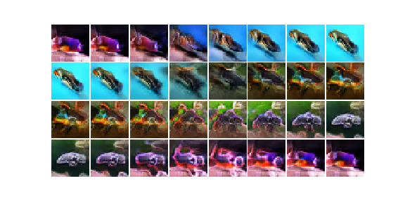

# WGAN-GP

This is heavily influenced by ProgressiveGAN, but I didn't use the progressive aspect. Overall, a big success.  I shrunk the figures to 32x32 and then used those to train the GAN.  See WGAN-GP.ipynb for specific implementations.

## The implementation

I used a fairly asymmetric architecture to generate this (listed below) with the following aspects included:  
* Wasserstein metric with gradient penalty lambda=10.0 (WGAN-GP)
* Pixel normalization in the generator
* Mini-batch standard deviation in the critic
* Dropout in the critic (0.5)
* The critic shrunk via stride 2, kernel-size 4; while the generator grew via upsampling (used upsampling instead of stride due to checkerboard artifacts)
* Added a drift term to the critics loss (0.001 * {critic outputs^2}
* Used image augmenation - rot=25, wshift=0.05, hshift=0.1, shear=10, zoom=[0.95,1.2], brightness=[0.8,1.4]; also adjusted color saturation using a random.triangle from [0.6,1.4] for R, G, and B individually
* Used a running average generator for output with an exponential loss of 0.999
* Ran critic 4 times for every one generator run
* Used Adam with beta1 = 0, beta2 = 0.99 with a learning rate of:
- lr = 0.0001 for the first 200 epochs; lr = 0.00003 for the next 500 epochs
 
## Some things I tried but did not use here:
* I did NOT use equalized learning rate on the layers.  I might be tempted to try this, but the images are fairly diverse, and this is where I would see this helping most.
* I experimented with a randomized learning rate per mini-batch along the way - 
in essence, I tried to populate the inverse of the learning rate 
uniformly for both the generator and critic. 
I also explored adding a rare, large lr to generator for one mini-batch 
in the hopes that this might help vacate local mimima. 
It worked pretty well, I think.  I did not use it for this, but I do want to experiment with it more.

## Well, how could this be improved?  
* I could try to restart with an extended architecture that goes to 64x64, but I am pessimistic about this working well.
* I could try to extend the architecture a la ProGAN, which might work.  
* I could run it longer, with a low learning rate and I think it will get a bit better - especially on improving the already fishy looking fish, however, I don't think this will do too much to prevent the poor quality images.

## Fishing in a diverse terrain

Some fish are truly wonderful.  Others... not so much.  I took steps to avoid mode-collaspe (Wasserstein and MBStdDev, especially), and the generator has done a great job, but this diversity is also the source of the crappy fish.

 

Above you can see at the ends four pretty decent looking fish.  As I walk from one point of a good fish in the latent space to another, the fish smoothly evolve into one another and we have a nice fish all along the way.  On the other hand, if I consider fish with vastly different shapes and structures: 

I lose the intermediate fish, simply because in deforming one image into another, I (and the critic) no longer recognize these intermediate images as fish.  
Although my generator makes excellent and very different fish at one point in the plane, the image simply has to atop being fishy as I go from one to another.  Short of losing one of the diverse images, I am not sure how much can really be done when any path to deform one image to another must make something that looks decidedly non-fish-like on the way.   

## The specific architecture
### Generator
Model: "sequential_6"
_________________________________________________________________
Layer (type)                 Output Shape              Param    
_________________________________________________________________
dense_6 (Dense)              (None, 8192)              2105344   
reshape_3 (Reshape)          (None, 8, 8, 128)         0         
conv2d_transpose_15 (Conv2DT (None, 8, 8, 128)         409728    
pixel_norm_12 (PixelNorm)    (None, 8, 8, 128)         0         
leaky_re_lu_30 (LeakyReLU)   (None, 8, 8, 128)         0         
conv2d_transpose_16 (Conv2DT (None, 8, 8, 128)         262272    
pixel_norm_13 (PixelNorm)    (None, 8, 8, 128)         0         
leaky_re_lu_31 (LeakyReLU)   (None, 8, 8, 128)         0         
_________________________________________________________________
up_sampling2d_6 (UpSampling2 (None, 16, 16, 128)       0         
conv2d_transpose_17 (Conv2DT (None, 16, 16, 128)       409728    
pixel_norm_14 (PixelNorm)    (None, 16, 16, 128)       0        
leaky_re_lu_32 (LeakyReLU)   (None, 16, 16, 128)       0         
_________________________________________________________________
up_sampling2d_7 (UpSampling2 (None, 32, 32, 128)       0         
conv2d_transpose_18 (Conv2DT (None, 32, 32, 128)       409728    
pixel_norm_15 (PixelNorm)    (None, 32, 32, 128)       0         
leaky_re_lu_33 (LeakyReLU)   (None, 32, 32, 128)       0         
conv2d_transpose_19 (Conv2DT (None, 32, 32, 3)         9603      
_________________________________________________________________
Total params: 3,606,403
Trainable params: 3,606,403
Non-trainable params: 0

### Critic

Model: "sequential_7"
_________________________________________________________________
Layer (type)                 Output Shape              Param    
_________________________________________________________________
conv2d_18 (Conv2D)           (None, 32, 32, 128)       9728      
leaky_re_lu_34 (LeakyReLU)   (None, 32, 32, 128)       0         
dropout_15 (Dropout)         (None, 32, 32, 128)       0         
_________________________________________________________________
conv2d_19 (Conv2D)           (None, 16, 16, 128)       262272    
leaky_re_lu_35 (LeakyReLU)   (None, 16, 16, 128)       0         
dropout_16 (Dropout)         (None, 16, 16, 128)       0         
_________________________________________________________________
conv2d_20 (Conv2D)           (None, 8, 8, 128)         262272    
leaky_re_lu_36 (LeakyReLU)   (None, 8, 8, 128)         0         
dropout_17 (Dropout)         (None, 8, 8, 128)         0         
_________________________________________________________________
conv2d_21 (Conv2D)           (None, 4, 4, 256)         524544    
leaky_re_lu_37 (LeakyReLU)   (None, 4, 4, 256)         0         
dropout_18 (Dropout)         (None, 4, 4, 256)         0         
conv2d_22 (Conv2D)           (None, 4, 4, 256)         590080    
leaky_re_lu_38 (LeakyReLU)   (None, 4, 4, 256)         0         
dropout_19 (Dropout)         (None, 4, 4, 256)         0         
conv2d_23 (Conv2D)           (None, 4, 4, 256)         1048832   
leaky_re_lu_39 (LeakyReLU)   (None, 4, 4, 256)         0         
mb_st_dev_3 (MBStDev)        (None, 4, 4, 257)         0         
flatten_3 (Flatten)          (None, 4112)              0         
dense_7 (Dense)              (None, 1)                 4113      
_________________________________________________________________
Total params: 2,701,841
Trainable params: 2,701,841
Non-trainable params: 0
_________________________________________________________________

